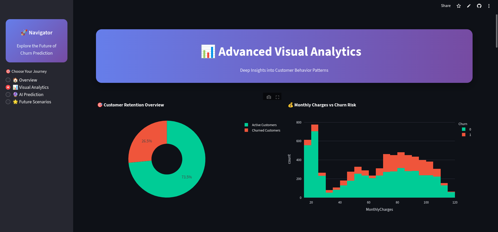
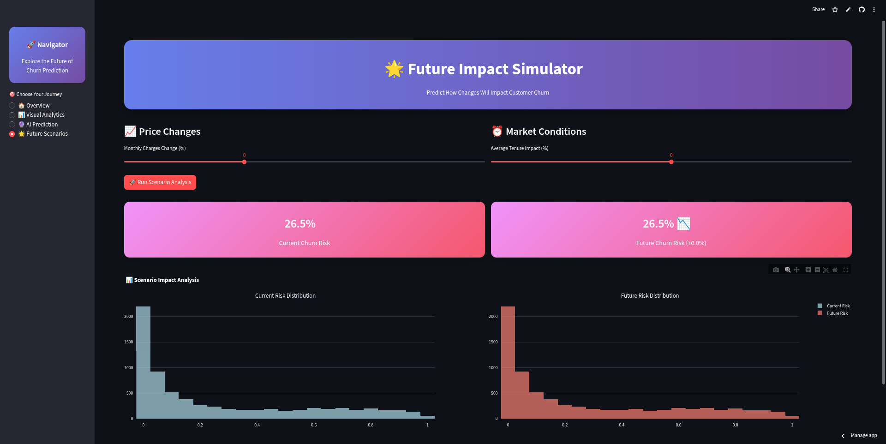
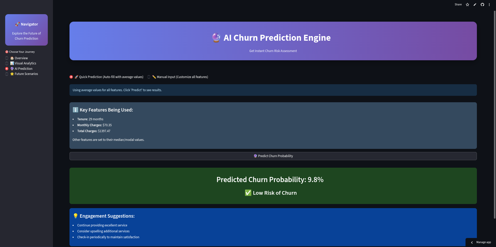
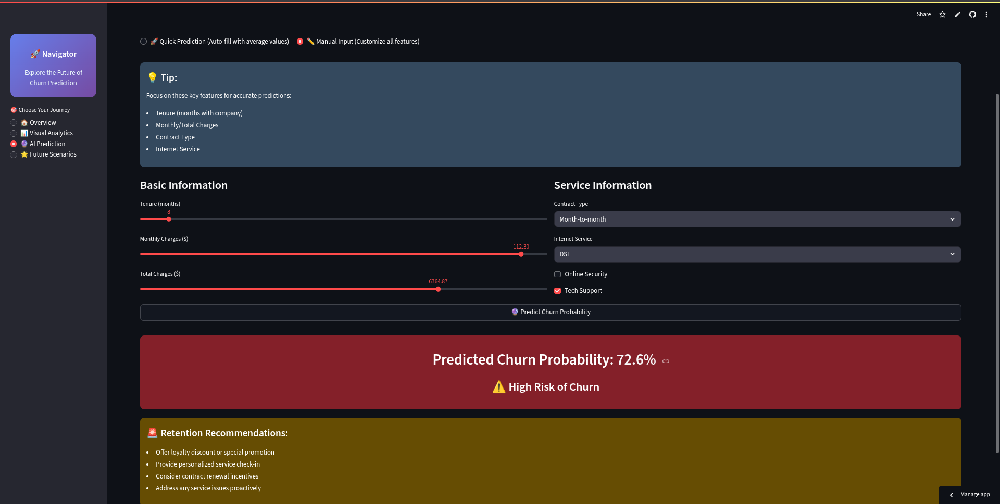
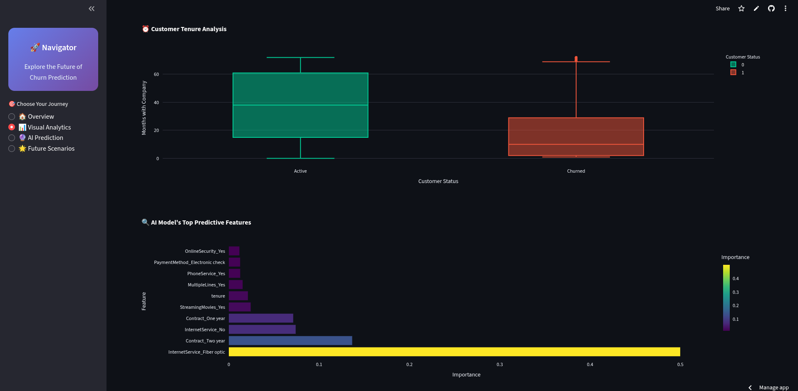

<h1 align="center"> Customer Churn Prediction Dashboard</h1>

 ## 🚀 Overview

The **Churn Prediction Dashboard** is a machine learning-powered web app that identifies which customers are at risk of leaving a service. Built with real-world telecom data, this tool helps business teams proactively engage with users before churn happens.

It features:
- Interactive churn prediction
- Real-time risk recommendations
- Gender-wise and contract-wise visual insights
- Future scenario simulation
- CSV download support

---
##  Features

✅ **Predict churn probability per customer (0 = Active, 1 = Churned)**  
📈 **Visualize top churn drivers using feature importance**  
🔍 **Smart charts: Tenure, Monthly Charges, Gender Analysis**  
🔮 **Future Churn Simulator (change charges & tenure)**  
📥 **Download full customer dataset**  
🌑 **Sleek dark-mode dashboard UI**  
🧠 **Trained with XGBoost ML Model**

---

##  Tech Stack Used

This project combines modern ML tools with a rich frontend:

- **📊 Streamlit** – For interactive dashboard UI
- **📈 Plotly & Seaborn** – Visualizing customer trends
- **🐍 Python** – Core logic and modeling
- **🧮 Pandas & NumPy** – Data preprocessing & handling
- **🧠 Scikit-learn & XGBoost** – Model training and evaluation
- **📄 CSV Dataset** – Kaggle’s Telco Customer Churn Dataset

---

##  Machine Learning Model

We use [XGBoost](https://xgboost.readthedocs.io/en/stable/) as the main model:
- Trained on engineered features like `tenure`, `contract`, `monthly charges`, etc.
- High accuracy in predicting churn likelihood
- Feature importance extracted for business interpretation

---

##  Visual Insights

---
